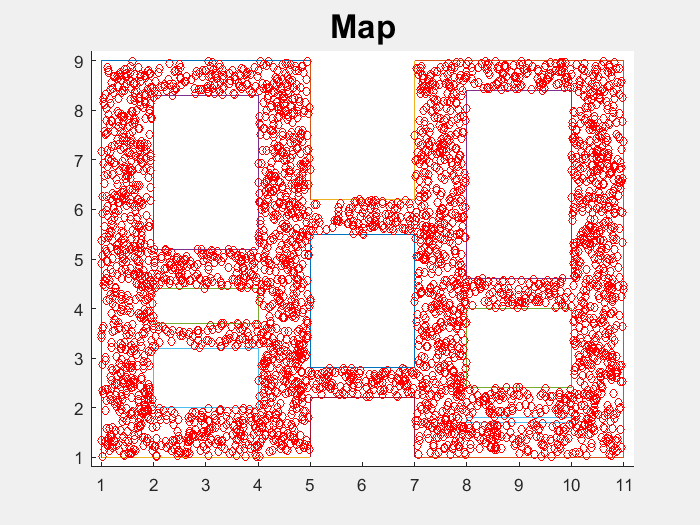

# Portfolio projects in robotics and ADAS

In this repository I will share the **source code** of all the projects of my recent courses from the previous months.

Hope this might be useful to someone! :-)

## Overview

### Projects

<table style="width:100%">
  <tr>
    <th>
      

           
            Project 1
            <a href="./project_1" name="p1_code">(code)</a>
      

    </th>
        <th>

           
            Project 2
            <a href="./project_2" name="p2_code">(code)</a>
        

    </th>
       <th>

           
            Project 3
            <a href="./project_3" name="p3_code">(code)</a>
        

    </th>
        <th>

           
            Project 4
            <a href="./project_4" name="p4_code">(code)</a>
        

    </th>
  </tr>
  <tr>
    <th>

           
            Project 5
            <a href="./project_5" name="p5_code">(code)</a>
        

    </th>
        <th>

           
            Project 6
            <a href="./project_6" name="p6_code">(code)</a>
        

    </th>
    <th>

           
            Project 7
            <a href="./project_7" name="p7_code">(code)</a>
        

    </th>
    <th>

           
            Project 8
            <a href="./project_8" name="p8_code">(code)</a>
        

    </th>
  </tr>
  <tr>
    <th>

           
            Project 9
            <a href="./project_9" name="p9_code">(code)</a>
        

    </th>
    <th>

           
            Project 10
            <a href="./project_10" name="p10_code">(code)</a>
        

    </th>
   <th>

           
            Project 11
            <a href="./project_11" name="p11_code">(code)</a>
        

    </th>
    <th>

          
            Project 12
            <a href="./project_12" name="p12_code">(code)</a>
        

    </th>
  </tr>
</table>

--- 
## Table of Contents

#### [Project 1](project_1)
 - **Summary:** Summary test.
 - **Keywords:** Keywords test.
 
#### [Project 2](project_2)
 - **Summary:** Summary test.
 - **Keywords:** Keywords test.
 
#### [Project 3](project_3)
 - **Summary:** Summary test.
 - **Keywords:** Keywords test.

#### [Project 4](project_4)
 - **Summary:** Summary test.
 - **Keywords:** Keywords test.
 
#### [Project 5](project_5)
 - **Summary:** Summary test.
 - **Keywords:** Keywords test.
 
#### [Project 6](project_6)
 - **Summary:** Summary test.
 - **Keywords:** Keywords test.

#### [Project 7](project_7)
 - **Summary:** Summary test.
 - **Keywords:** Keywords test.
 
#### [Project 8](project_8)
 - **Summary:** Summary test.
 - **Keywords:** Keywords test.
 
#### [Project 9](project_9)
 - **Summary:** Summary test.
 - **Keywords:** Keywords test.
 
#### [Project 10](project_10)
 - **Summary:** Summary test.
 - **Keywords:** Keywords test.

#### [Project 11](project_11)
 - **Summary:** Summary test.
 - **Keywords:** Keywords test.

#### [Project 12](project_12)
 - **Summary:** Summary test.
 - **Keywords:** Keywords test.

 

  

