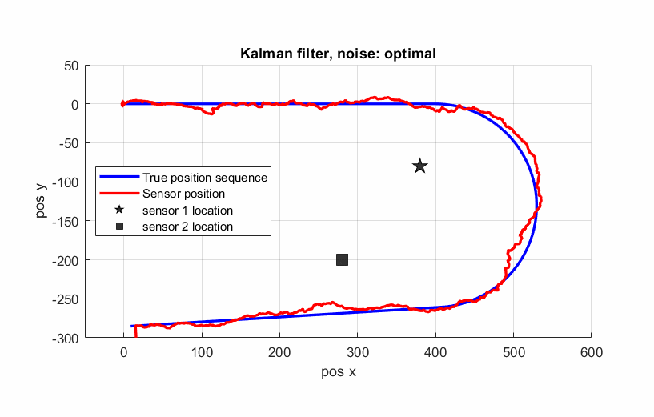
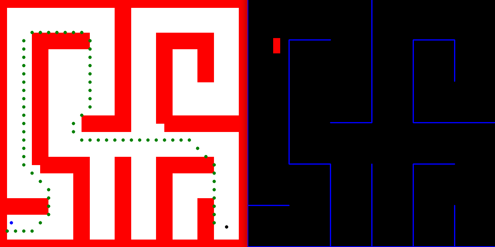
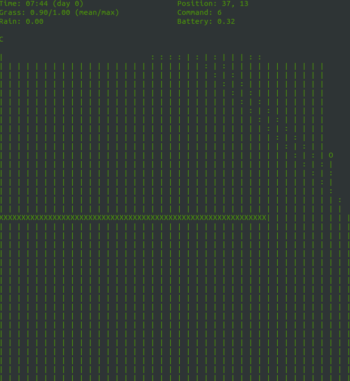

# Portfolio projects in robotics and ADAS

In this repository I will share the **source code** of all the projects of my recent courses.

Hope this might be useful to someone! :-)

All the results and extra certificates can be found here:

- [edX Micromaster Program](https://credentials.edx.org/records/programs/shared/aeb398577a5c4941aaafc6133845c9d2/)

- [Main project: Autonomous robots (bottom of page 1)](https://www.student.ladok.se/student/verifiera/intyg/19890130-6475/J16M02CIK4)

- [Robotics: Vision Intelligence and Machine Learning - certificate by University of Pennsylvania](https://courses.edx.org/certificates/cebbf84bc3d549bca3e86871f49b7917)

- Embedded Systems (3 parts) by The University of Texas:

  - [Microcontroller Input/Output](https://courses.edx.org/certificates/45a2dae1257b4789b444b585c6c6ba1f)

  - [Multi-Threaded Interfacing](https://courses.edx.org/certificates/a93d7756388944cd88f1a6acd78e0b12)

  - [Real-Time Bluetooth Networks](https://courses.edx.org/certificates/4ad6f76b46a4430cb8e35aea61366bbe)

- [Intermediate C++ - certificate by Microsoft](https://courses.edx.org/certificates/daf8897c283c43f6a635eb8228dff1dc)

- [Advanced C++ - certificate by Microsoft](https://courses.edx.org/certificates/d7c3c0aea54d4a86971d8b4652822af0)

## Overview
### Main Project
Main project is a self driving car in virtual environment. Physical equivalent is under development.
      

           
            Main project - self driving car
            <a href="./main_project" name="Code in C++ and Python/OpenCV">(Code in C++ and Python/OpenCV)</a>
      

### Smaller projects

<table style="width:100%">
  <tr>
    <th>

           
            Project 2
            Cubature Kalman Filter
            <a href="./project_2" name="p2_code">(Matlab code)</a>
        

    </th>
    <th>

           
            Project 3
            Particle filter
            <a href="./project_3" name="p3_code">(Matlab code)</a>
        

    </th>
  </tr>
  <tr>
    <th>

           
            Project 4
            Path planning
            <a href="./project_4" name="p5_code">(C++/OpenCV code)</a>
        

    </th>
    <th>

           
            Project 5
            Behaviour based robotics
            <a href="./project_5" name="p6_code">(C++ code)</a>
        

    </th>
  </tr>
</table>

--- 
## Table of Contents

#### [Main Project](main_project)
 - **Summary:** Summary test.
 - **Keywords:** Keywords test.
 
#### [Project 2](project_2)
 - **Summary:** Summary test.
 - **Keywords:** Keywords test.
 
#### [Project 3](project_3)
 - **Summary:** Summary test.
 - **Keywords:** Keywords test.

#### [Project 4](project_4)
 - **Summary:** Summary test.
 - **Keywords:** Keywords test.
 
#### [Project 5](project_5)
 - **Summary:** Summary test.
 - **Keywords:** Keywords test.
