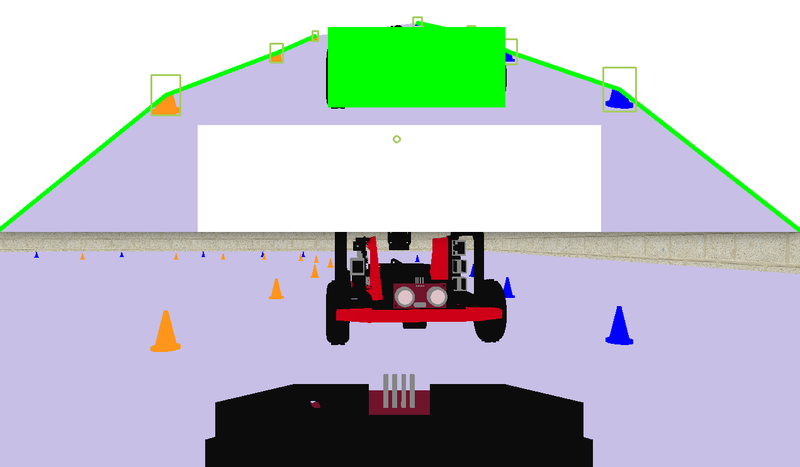
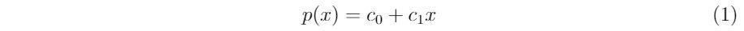
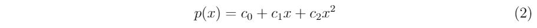
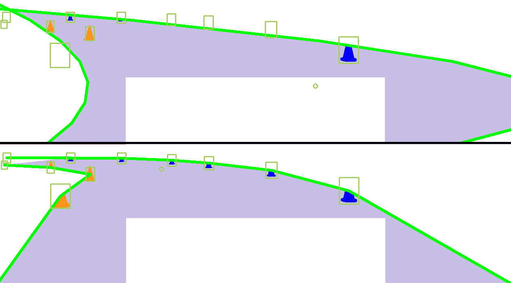
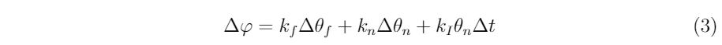
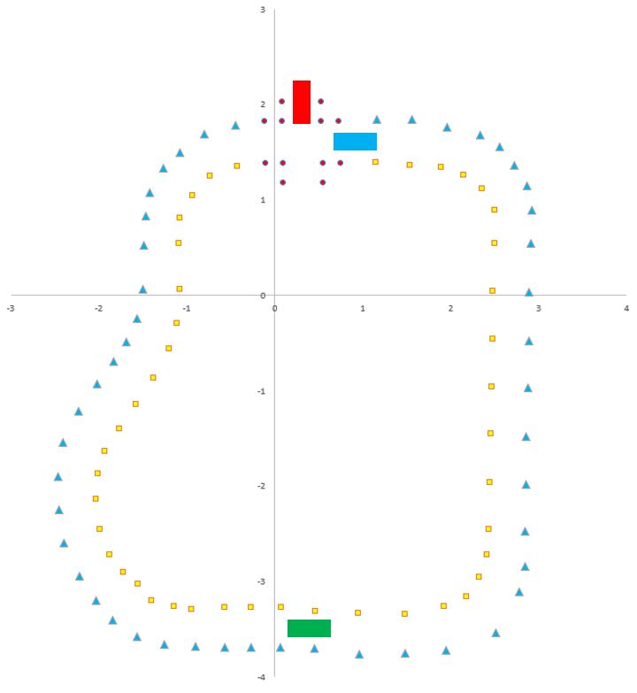

# Prerequisites

To be updated soon
cmake
libcluon
UDP multicast
curl
Docker

## 1 Overview
The project assignment was to design a robot behavior for the robot car (both physical and virtual version) to drive around a track, without hitting any cones or other cars (by keeping the distance relatively constant behind a slower vehicle) and keeping right-hand rule in an intersection.

## 2 Perception
Due to the performance limit of the Raspberry Pi, it was decided to use basic image processing methods, instead of machine learning algorithms. The basic idea behind the perception algorithm is to identify the cones, fit a curve on each cone line, remove the visual information outside of them and identify other car (masked with green rectangle to remove red/black information from the screen) or crossing scenario in the remaining image (red cones). If crossing scenario
is identintified, the full image without white mask is checked for another car, to reduce risk of collision due to undetected car.

### 2.1 Track detection
A near and far point are used in order to describe the track in front of the kiwi car. These two points are arrived at through a number of steps, finding the cones on the track, fitting curves to the detected cones and placing the points given the curves.

  

#### 2.1.1 Track detection
First, the top part of the image is removed, as it is outside of the track and the misdetections can be reduced for the vision algorithm. For the same reasons  a white box is printed in the area of the ego kiwi.  Secondly, the image is blurred to remove noise and select all parts of the image that lies in a given color range (blue or yellow, depending on cones). Thirdly, the identified cones are gathered and after removing some smaller components, find all the bounding boxes of the leftover isolated components. Lastly, the bounding boxes that do not match certain criteria are filtered out. These criteria constrain the size, shape and position. The centres of these bounding boxes are used for curve fitting.

#### 2.1.2 Curve fitting
Two curve fitting methods were implemented. The first one fits a polynomial curve the least-squares method to the cones of a single colour.
In order to increase robustness, a fake cone is added to the corner of the image at the appropriate side of the car.
If the number of cones are less than 4, the linear polynomial

  

is used. If the number of cones is 4 or greater, the polynomial

  

is used. Once again, this is to increase robustness.
Increasing the degree of the polynomial will result in a lower residual fit but will also decrease the quality of the fit.
If  polynomials of higher degrees are used then the result will be overfitted.

The second method is to fit linear segments between each subsequent pair of cones.
For this method a fake cone is also added to the corner of the image. As compared to the earlier method, this method is much more robust.
The downside is that it is not able to generalize to undetected parts of the track, nor is it able to smoothly interpolate in between cones, albeit this is of less a concern.

  

  Example of curves generated by (top) the polynomial method and (bottom) the linear segments method.

Due to the way that the perception module and the steering control interacts, it turns out that the polynomial method handles staying between the cones better.
With the linear segments method, the car has a tendency to take rather tight corners.
The polynomial fit on the outside of the corner usually bends outwards, which results in a better near point position, which keeps the kiwi from running over the cones.
In \autoref{fig:curve_fit} one can see how the right polynomial fit curves outside the image, thus resulting in a near point that is farther to the right.

Near intersections, on the other hand, there is a different outcome.
The polynomial method has difficulties crossing these parts.
The linear segments method was left as the active method in the code.
The method may be changed by modifying line 178 in \texttt{perception.py}.

#### 2.1.3 Near and far point estimation
There are three cases of curve detections that needs to be considered when the near and far points are estimated.
Firstly, whenever it fails to fit curves on either side of the track, a near and far point is not generated.
Secondly, if only one side has curve detection of the track the points are estimated using two different criteria.
The near point is placed at the opposite side, with regards to the center of the screen, of the detected side, and at an arbitrary height.
The exact distance from the center is tuned by hand.
The far point is placed a fixed distance from the detected curve at a specific height.
This height is tuned by hand.
Lastly, there is the case in which there is access to both curves. For both the near and far point  the average value of the curves are taken at a specific height.
Once again, this height is tuned by hand.

### 2.2 Kiwi detection
The detection of other Kiwi cars are done in a similar order as the cone detection color filtering, but with a combined red and black mask. After identifying these areas, close regions are merged together and the bounding box of the biggest shape is taken, if it satisfies specific size and shape ratio measures.
Once the bounding box is gathered, the bottom left corner's X and Y positions are taken. Y position is for the distance estimation for the braking function, while the X position is for the intersection scenario, to see if there is a car in the intersection.

### 2.3 Kiwi detection
The intersection recognition is based on the visual information from the upper part of Figure 1. After removing the out-of-track and other kiwi information from the screen, the remaining area is checked for red visuals. If the left and right half of the picture contains more than 2 separate red spots, it is considered as an intersection and a boolean is sent for further processing. The center of the identified intersection is used to help to navigate the kiwi, temporally overwriting the near and far angle estimates from the curve fit.

## 3 Control
### 3.1 Steering control
As mentioned in the track detection section, near and far points are generated to indicate where the kiwi car should go.
In order to turn these two points into actions a control model is used from \cite{steeringcontrol}. Each time either the near or far point is updated a new steering angle is computed  according to

  

where $\theta_f$ is the far angle, $\theta_n$ is the near angle and $k_f, k_n, k_i$ are hyperparameters.
As there is no steering angle sensor (in the simulation at least), the current steering angle is also tracked by assuming that the requested steering angle is achieved perfectly.
The values used for the hyperparameters, taken from the original article, are $k_f=30, k_n=13.5, k_I=36$.
As the model is dependent on time, an options is also included to pass a \texttt{timemod} argument to the program. This allows us to scale the steering control so that it matches the remaining programs in the simulation. 
The whole program is organized as a single file and is deployed as a docker container.

### 3.2 Speed control
There is a separate docker container, \texttt{logic-pedal-position} to control the pedal position.
It receives information from the perception part. It gets the distance to another car in both x and y directions, it also gets information if an intersection has been identified. To avoid crashing into a car in front a P-controller was implemented to keep a constant distance to the car ahead. This means that the car can follow another car without crashing into it. If another car has been identified at an intersection, the car slows down and waits for the other car to pass. It was also added that the car slows down in sharp curves. This is done by reading the current steering angle. If a large steering angle is used, the car will slow down proportionally to the steering angle. This was done in order to maintain a high speed on a straight road without risking the curves becoming too difficult to handle.

### 4 Virtual testing
The virtual test cases were developed in a way to be able to test all scenarios in one single simulation session. The standard track was modified with an intersection part at the upper part of the figure. The starting position of the ego vehicle is represented by the blue rectangle and it starts in an intersection. The representation of the slower vehicle in task 2 is the green rectangle and it is called Kiwi two, while the observed vehicle in task 3 crossing scenario is the red rectangle and it is called Kiwi three.

  

### 5 Running the project
