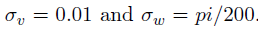

## Noise and its tuning
The CKF has been chosen to be used due to its superior performance in comparison to the other Kalman filters. The filtering effects of changing the model noise covariance for speed and yaw rate are presented in the table below. The parameters were increased/decreased by 4 orders of magnitude.

Table 1: Effect of changing the model noise covariance for speed and yaw rate in the CT motion model.

  

Taking into account the true trajectory, we observe that the speed is constant all the time. Since we have a good prior distribution, we do not even need to have a speed covariance in the motion model because a good prior distribution and the update step based on the measurements will be enough to drive the system to the desired constant speed. In sum, the speed noise covariance is needed when the system is subjected to accelerations, which is only the case at the beginning of the simulation when we are not sure about the true vehicle and we need to correct this value to the true one.

Moreover, the yaw rate noise covariance was tuned in such a way that the output was not too noisy  and could follow well the trajectory mainly during the transition straight-curve. The good parameters found were:

  

 

It is also important to notice that we need to discretize the noise before applying to the Kalman filter formulas, such that:

  

 

## Results
We now proceed to present typical results by generating a measurement sequence, and filtering with The sensor positions, the positions corresponding to the measurements, the true position sequence, and the estimated position sequence for three different process noise settings: too small, too large, and well-tuned are shown in Figures 1, 2, and 3 respectively.
As discussed above, setting the motion model noise covariance too low will result in a model that is not able to accelerate in terms of position and yaw angle as desired when changing from straight to curve and vice-versa. This can be seen in the position error plot, which starts to increase at t=20s when the vehicle leaves the straight and faces a abrupt yaw-acceleration to enter in the curve and at t=50s when it goes back to the straight line needing again a yaw-acceleration.
On the other hand, if the variances are set too high, the filter tends to trust more the measurements, which are very noisy, leading to very noisy and unrealistic outputs. In this case, the position errors are higher when the true position is aligned with the two sensor locations. This is reasonable, since small changes in the measured angles by the sensors will cause a drastic change in the measured object position. Therefore, since in this case we rely much on the measurements, the position error will be higher on those regions (t=14s and t=46s).
The well-tuned model is then able to maintain a fairly low and mostly constant error for all the regions. Therefore, we confirm that the filter performs well because it is not only able to maintain low errors in the steady state during the straight line and curve but also it is able to accelerate and change the state without lag.

  

Figure 1: Process noise settings: too small

  

Figure 2: Process noise settings: too large

  

 
Figure 3: Process noise settings: well tuned

## Accuracy
It is not possible to tune the filter to have a good accuracy all the time for this sequence. The problem is that there are optimal tuning parameters for the straight line and curve and for the transition.
In the straight line and during the curve, the best option is to set both v and w very low, since there is no change in speed and angular velocity. Indeed, this requires a good prior distribution, so the filter does not need to accelerate too much its position and yaw in order to correct its values.
However, once tuned in that way, the model is not able to follow the transition between straight line and curve properly, as shown in Figure 1. For scenarios with large accelerations in position and yaw, we want to set v and w to larger values.
This conflict of effects makes diffcult to tune the filter so we get a very precise and accurate outputs. Despite all this, the parameters chosen as in Figure 3 are reasonably good given the very noise measurements.
