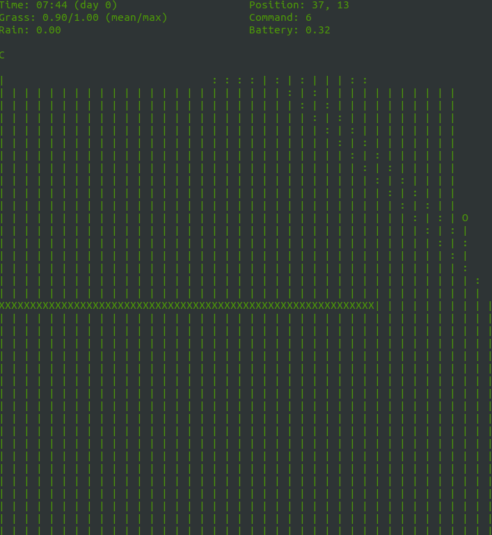
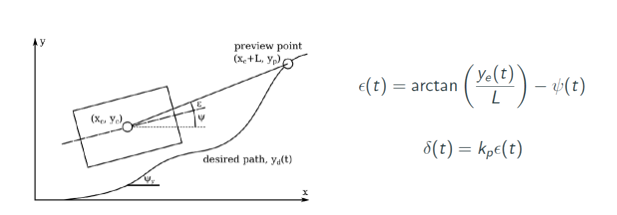

# General description
The opendlv-logic-pathfollower.cpp at part I plots the map line by line and then finds the path. The walls should be defined from bottom to top in vertical and left to right in horizontal case.

The first part is to create the grids and checking for start and end position and their validity (not defined on a wall), and mark the cells where is wall (if wall is at border of grids both grids will be considered as wall, thus the gridsize should be kept low, in order to leave enough space for the robot to move freely).

After the grid initialization the script checks all the horizontal, vertical and diagonal neighbors of the current node (in case of start the start node) and updates their distances in the distances container and marks their parent in the parent container, after that the neighbor with the closest distance is chosen and set it to the current node and the neighbors are checked again, and their distances are updated if it is needed, according to the Dijkstra's algorithm.

Once the end point is reached, the process stops (or gives message if end is not reachable). When the end points is valid, it uses the parent container to trace back the parents of the end node, thus the shortest path is gathered.

When the path is found it is plotted together with the grids of wall (as noted before, at grid border wall uses both neighbors grids, thus the intersection of the shortest path and grids sometimes, but in reality the wall is away from the edge of grid), see “Grid map” window. Blue dot is the start position, black dot is the end and the path is the green dots.

  

At the part II of the script the control is done based on the calculated shortest path from part I. First, the nearest node on the path to the kiwi position is calculated, then the next node on the path is set as an aim point for  “Simplest aim point model” from the lecture material:

  

 
Thus the ground steering δ is calculated (k was chosen to 1.0 after some tuning) and requested. The speed request is set constant during the whole simulation. The path following robots can be observed at the “Global map” window, where the wall positions are plotted with robot itself. The room is esimated to be reasonable size (around 6x6m), since OpenCV takes the integer values as pixel size, everything is scaled 100x to be normally visible (with scaleFactor variable). Once the end point is reached the message is sent to the user to stop the program.

## To run the solution

The solution is opendlv-logic-pathfollower.cpp and runs with the following commands:

go to project root folder

xhost +

docker build -f Dockerfile -t opendlv-logic-pathfollower-kiwi .

docker-compose -f simulate-kiwi.yml up
